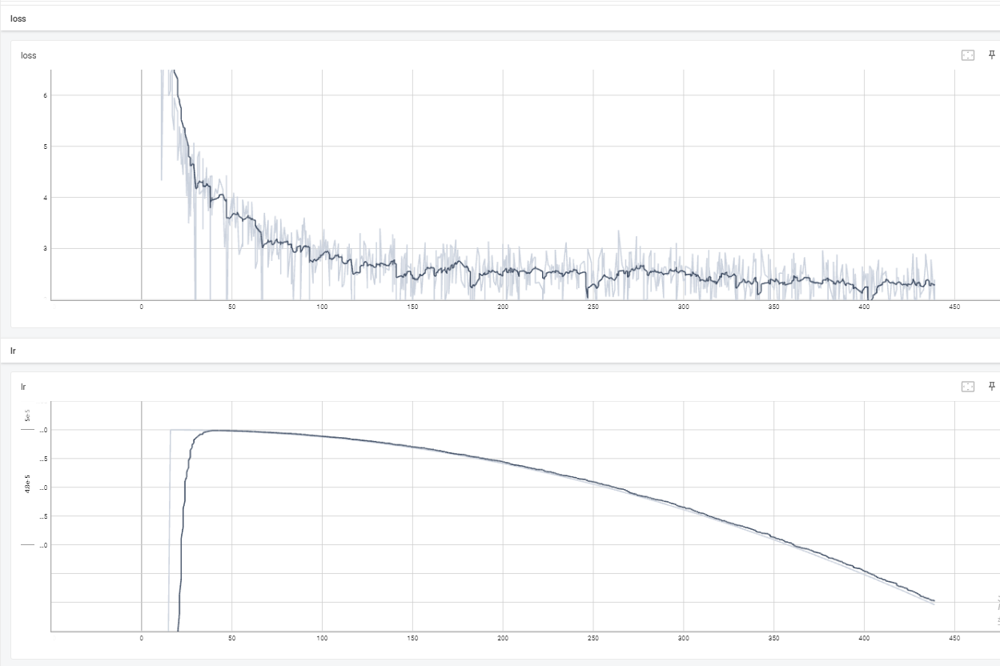
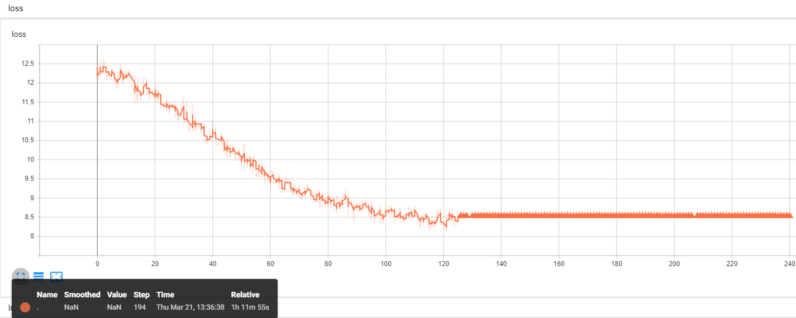
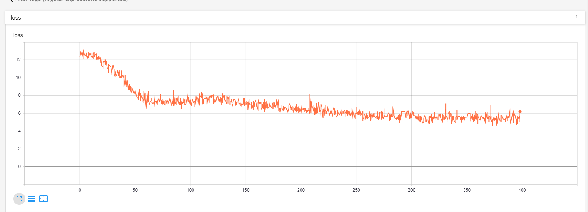

# Qwen1.5-SFT
Qwen1.5-SFT(阿里, Ali), Qwen_Qwen1.5-2B-Chat/Qwen_Qwen1.5-7B-Chat微调(transformers)/LORA(peft)/推理

## 项目地址
 - [https://github.com/yongzhuo/qwen1.5-sft](https://github.com/yongzhuo/qwen1.5-sft)
 - 默认数据类型为bfloat6

## 备注
```python
1. 非常重要: weights要用bfloat16/fp32/tf32(第二版大模型基本共识), 不要用fp16, fp16会特别容易loss=NAN;
2. SFT最好还是像预训练那样, input/output都计算loss;
2. transformers需要4.37.0及以上;
3. qwen1.5, 0.5/1.8/4/7B模型的词典大小为151936(可以除以128), 14/72B模型的字典大小为152064(可以除以256); 多语言版本, 包含繁/简体;
4. qwen1.5网络架构同Llama; 
5. prompt:
   5.1 标准格式为: 
text_input + text_output + <|endoftext|>
   5.2 prompt格式为: 
<|im_start|>system
{text_prompt}<|im_end|>
<|im_start|>user
{text_input}
<|im_end|>
<|im_start|>assistant
{text_output}
<|im_end|>
6 微调输入输出:
    输入："<|im_start|>system\n{text_prompt}<|im_end|>\n<|im_start|>user\n{text_input}\n<|im_end|>"
    输出："<|im_start|>assistant\n{text_output}\n<|im_end|>"
7 推理输入输出(assistant\n放置位置不同):
    输入："<|im_start|>system\n{text_prompt}<|im_end|>\n<|im_start|>user\n{text_input}\n<|im_end|>\n<|im_start|>assistant"
    输出："{text_output}\n<|im_end|>"
8. 网络各层名称
('base_model.model.model.embed_tokens.weight', torch.bfloat16, False)
('base_model.model.model.layers.31.self_attn.q_proj.weight', torch.bfloat16, False)
('base_model.model.model.layers.31.self_attn.q_proj.bias', torch.bfloat16, False)
('base_model.model.model.layers.31.self_attn.q_proj.lora_A.default.weight', torch.float32, True)
('base_model.model.model.layers.31.self_attn.q_proj.lora_B.default.weight', torch.float32, True)
('base_model.model.model.layers.31.self_attn.k_proj.weight', torch.bfloat16, False)
('base_model.model.model.layers.31.self_attn.k_proj.bias', torch.bfloat16, False)
('base_model.model.model.layers.31.self_attn.k_proj.lora_A.default.weight', torch.float32, True)
('base_model.model.model.layers.31.self_attn.k_proj.lora_B.default.weight', torch.float32, True)
('base_model.model.model.layers.31.self_attn.v_proj.weight', torch.bfloat16, False)
('base_model.model.model.layers.31.self_attn.v_proj.bias', torch.bfloat16, False)
('base_model.model.model.layers.31.self_attn.v_proj.lora_A.default.weight', torch.float32, True)
('base_model.model.model.layers.31.self_attn.v_proj.lora_B.default.weight', torch.float32, True)
('base_model.model.model.layers.31.self_attn.o_proj.weight', torch.bfloat16, False)
('base_model.model.model.layers.31.mlp.gate_proj.weight', torch.bfloat16, False)
('base_model.model.model.layers.31.mlp.up_proj.weight', torch.bfloat16, False)
('base_model.model.model.layers.31.mlp.down_proj.weight', torch.bfloat16, False)
('base_model.model.model.layers.31.input_layernorm.weight', torch.bfloat16, False)
('base_model.model.model.layers.31.post_attention_layernorm.weight', torch.bfloat16, False)
('base_model.model.model.norm.weight', torch.bfloat16, False)
('base_model.model.lm_head.weight', torch.bfloat16, False)
9. RuntimeError: unscale_() has already been called on this optimizer since the last update().
    微调语料太少导致的
```

## 环境配置
```shell
transformers>=4.37.0
torch>=1.11.0
safetensors>=0.4.1
accelerate==0.27.1
fsspec==2023.9.2
rouge==1.0.1
nltk==3.6.6
peft>=0.2.0
numpy
tqdm
```

## 微调
```shell
地址: qwen2_sft/ft_qwen2

配置: qwen2_sft/ft_qwen2/config.py
训练: python train.py
推理: python predict.py
验证: python evaluation.py
接口: python post_api.py
```

## 数据集-中文
 - [https://huggingface.co/datasets/JosephusCheung/GuanacoDataset](https://huggingface.co/datasets/JosephusCheung/GuanacoDataset)
 - [https://huggingface.co/datasets/shareAI/shareGPT_cn](https://huggingface.co/datasets/shareAI/shareGPT_cn)
 - [https://huggingface.co/datasets/Mutonix/RefGPT-Fact](https://huggingface.co/datasets/Mutonix/RefGPT-Fact)
 - [https://huggingface.co/datasets/BAAI/COIG](https://huggingface.co/datasets/BAAI/COIG)
 - [https://github.com/Instruction-Tuning-with-GPT-4/GPT-4-LLM](https://github.com/Instruction-Tuning-with-GPT-4/GPT-4-LLM)
 - [https://github.com/carbonz0/alpaca-chinese-dataset](https://github.com/carbonz0/alpaca-chinese-dataset)
 - [https://github.com/LianjiaTech/BELLE](https://github.com/LianjiaTech/BELLE)
 - [https://github.com/PhoebusSi/Alpaca-CoT](https://github.com/PhoebusSi/Alpaca-CoT)
 - [https://github.com/Hello-SimpleAI/chatgpt-comparison-detection](https://github.com/Hello-SimpleAI/chatgpt-comparison-detection)
 - [https://github.com/yangjianxin1/Firefly](https://github.com/yangjianxin1/Firefly)
 - [https://github.com/XueFuzhao/InstructionWild](https://github.com/XueFuzhao/InstructionWild)
 - [https://github.com/OpenLMLab/MOSS](https://github.com/OpenLMLab/MOSS)
 - [https://github.com/thu-coai/Safety-Prompts](https://github.com/thu-coai/Safety-Prompts)
 - [https://github.com/LAION-AI/Open-Assistant](https://github.com/LAION-AI/Open-Assistant)
 - [https://github.com/TigerResearch/TigerBot](https://github.com/TigerResearch/TigerBot)


## 参考/感谢
 - [https://github.com/QwenLM/Qwen1.5](https://github.com/QwenLM/Qwen1.5)
 - [https://github.com/google/gemma_pytorch](https://github.com/google/gemma_pytorch)
 - [https://huggingface.co/google/gemma-2b-it](https://huggingface.co/google/gemma-2b-it)
 - [https://huggingface.co/spaces/HuggingFaceH4/open_llm_leaderboard](https://huggingface.co/spaces/HuggingFaceH4/open_llm_leaderboard)
 - [https://github.com/THUDM/ChatGLM-6B](https://github.com/THUDM/ChatGLM-6B)
 - [https://github.com/THUDM/GLM](https://github.com/THUDM/GLM)
 - [https://github.com/tatsu-lab/stanford_alpaca](https://github.com/tatsu-lab/stanford_alpaca)
 - [https://github.com/LianjiaTech/BELLE](https://github.com/LianjiaTech/BELLE)
 - [https://github.com/huggingface/peft](https://github.com/huggingface/peft)
 - [https://github.com/mymusise/ChatGLM-Tuning](https://github.com/mymusise/ChatGLM-Tuning)
 - [https://github.com/bojone/bert4keras](https://github.com/bojone/bert4keras)
 - [trl](https://github.com/lvwerra/trl)
 - [math23k](https://aclanthology.org/D17-1088)


## 微调日志-advgen
### 默认的bf16可微调, 最好也计算全部loss(同pt, input/output)
 

### fp16损失函数就为nan, image_advgen_loss_nan_7b_3e4_constranr_bs4_fp16
 

### fp16细调超参数偶尔训练成功但loss很高, image_advgen_dev_success_7b_2e5_cosine_bs2_fp16
 


## 推理日志-advgen
```cpu
('base_model.model.base_model.model.model.layers.31.self_attn.k_proj.bias', torch.float16, False, tensor([ 0.1016, -0.0640,  0.1729,  ..., -1.0312, -0.0028,  0.3477],
       device='cuda:0', dtype=torch.float16))
('base_model.model.base_model.model.model.layers.31.self_attn.k_proj.lora_A.default.weight', torch.float16, False, tensor([[-0.0045, -0.0027,  0.0057,  ...,  0.0131,  0.0074, -0.0049],
        [-0.0049,  0.0048, -0.0067,  ...,  0.0118,  0.0080, -0.0105],
        [-0.0052,  0.0086,  0.0070,  ..., -0.0102, -0.0005,  0.0166],
        ...,
        [-0.0097, -0.0158, -0.0116,  ...,  0.0051,  0.0046,  0.0015],
        [-0.0148,  0.0001, -0.0152,  ...,  0.0063,  0.0139,  0.0026],
        [-0.0092,  0.0036,  0.0003,  ..., -0.0082,  0.0063, -0.0058]],
       device='cuda:0', dtype=torch.float16))
('base_model.model.base_model.model.model.layers.31.self_attn.k_proj.lora_B.default.weight', torch.float16, False, tensor([[ 1.2102e-03,  1.9951e-03, -2.2488e-03,  ...,  1.2598e-03,
         -1.4429e-03, -2.0466e-03],
        [-5.9128e-05,  4.4274e-04,  1.4553e-03,  ..., -1.9350e-03,
         -8.8406e-04,  1.9855e-03],
        [ 1.5755e-03,  2.3174e-03, -2.6073e-03,  ..., -4.1466e-03,
         -2.8076e-03,  6.1464e-04],
        ...,
        [-1.5554e-03, -3.0460e-03,  4.4136e-03,  ...,  3.6411e-03,
          6.6280e-04,  5.5790e-04],
        [-1.5869e-03, -1.6050e-03, -1.0443e-03,  ...,  6.1393e-06,
          1.7271e-03, -1.2022e-04],
        [-3.7169e-04,  6.4754e-04,  7.2241e-04,  ...,  4.6730e-04,
          7.0667e-04, -1.1092e-04]], device='cuda:0', dtype=torch.float16))
......
('base_model.model.base_model.model.lm_head.weight', torch.float16, False, tensor([[ 0.0095, -0.0017, -0.0134,  ...,  0.0036,  0.0232, -0.0112],
        [ 0.0089, -0.0062,  0.0004,  ..., -0.0079,  0.0175, -0.0098],
        [ 0.0055,  0.0182,  0.0088,  ...,  0.0059,  0.0034, -0.0164],
        ...,
        [-0.0034, -0.0049,  0.0033,  ..., -0.0022, -0.0066,  0.0031],
        [-0.0034, -0.0071,  0.0032,  ..., -0.0022, -0.0066,  0.0013],
        [-0.0034, -0.0049,  0.0033,  ..., -0.0016, -0.0066,  0.0020]],
       device='cuda:0', dtype=torch.float16))
trainable params: 0 || all params: 7733907456 || trainable%: 0.0
151645
151644
151645
1699
872
8948
{'instruction': '类型#裙*版型#宽松*版型#显瘦*颜色#黑色*图案#撞色*裙型#直筒裙*裙款式#拼接', 'input': '', 'output': ''}
tensor([[151644,   8948,    198,   2610,    525,    264,  10950,  17847,     13,
         151645,    198, 151644,    872,    198,  31905,      2, 102807,      9,
          40301,  24300,      2, 109285,      9,  40301,  24300,      2,  99580,
         102372,      9, 102284,      2, 104723,      9, 108108,      2, 101340,
          38035,      9, 102807,  24300,      2,  73145, 106000, 102807,      9,
         102807, 108756,      2, 100278,  29077, 151645,    198, 151644,  77091]],
       device='cuda:0')
<|im_start|>system
You are a helpful assistant.<|im_end|>
<|im_start|>user
类型#裙*版型#宽松*版型#显瘦*颜色#黑色*图案#撞色*裙型#直筒裙*裙款式#拼接<|im_end|>
<|im_start|>assistant宽松显瘦的黑色直筒裙是女性衣橱里必不可少的单品，这款裙子采用经典的黑色调，十分显瘦显腿长。裙摆处采用撞色的拼接设计，增添层次感的同时又不失时尚气息。裙型采用直筒裙的版型，更加修饰腿型，遮肉效果极佳。无论是职场还是休闲都能轻松驾驭，轻松展现女性的优雅气质。<|im_end|>
请输入:
类型#上衣*材质#棉*颜色#白色*风格#休闲*图案#刺绣*衣样式#衬衫*衣领型#尖领*衣袖长#七分袖
请稍等...
################################################################################################################################
{'instruction': '类型#上衣*材质#棉*颜色#白色*风格#休闲*图案#刺绣*衣样式#衬衫*衣领型#尖领*衣袖长#七分袖', 'input': '', 'output': ''}
tensor([[151644,   8948,    198,   2610,    525,    264,  10950,  17847,     13,
         151645,    198, 151644,    872,    198,  31905,      2,  17447,  99741,
              9, 106149,      2, 102430,      9, 102284,      2, 102440,      9,
         104040,      2, 104443,      9, 108108,      2, 100253, 103084,      9,
          99741, 112453,      2, 113727,      9,  99741,  99213,  24300,      2,
         100512,  99213,      9,  99741, 102885,  45861,      2,  99612,  17177,
         102885, 151645,    198, 151644,  77091]], device='cuda:0')
<|im_start|>system
You are a helpful assistant.<|im_end|>
<|im_start|>user
类型#上衣*材质#棉*颜色#白色*风格#休闲*图案#刺绣*衣样式#衬衫*衣领型#尖领*衣袖长#七分袖<|im_end|>
<|im_start|>assistant这款白色刺绣休闲衬衫采用优质的纯棉材质，亲肤透气，穿着舒适亲肤。经典的尖领设计，修饰脸型，展现个性风格。七分袖的设计，既能凸显出修长的手型，又能带来一丝休闲的韵味。精致的刺绣图案，层次丰富，细节精致，凸显出独特的个性品味。这款衬衫无论是日常出街还是职场穿搭，都能展现出独特的休闲风格。<|im_end|>
27.06706738471985
请输入:
类型#裙*版型#显瘦*材质#牛仔布*风格#复古*风格#性感*图案#复古*裙型#牛仔裙*裙型#包臀裙*裙下摆#开叉*裙下摆#毛边*裙长#半身裙
请稍等...
################################################################################################################################
{'instruction': '类型#裙*版型#显瘦*材质#牛仔布*风格#复古*风格#性感*图案#复古*裙型#牛仔裙*裙型#包臀裙*裙下摆#开叉*裙下摆#毛边*裙长#半身裙', 'input': '', 'output': ''}
tensor([[151644,   8948,    198,   2610,    525,    264,  10950,  17847,     13,
         151645,    198, 151644,    872,    198,  31905,      2, 102807,      9,
          40301,  24300,      2,  99580, 102372,      9, 106149,      2, 100664,
         102437,  51827,      9, 104040,      2, 111455,      9, 104040,      2,
         110803,      9, 108108,      2, 111455,      9, 102807,  24300,      2,
         100664, 102437, 102807,      9, 102807,  24300,      2,  67279, 117318,
         102807,      9, 102807,  16872, 100805,      2,  29767, 102940,      9,
         102807,  16872, 100805,      2,  99676,  99319,      9, 102807,  45861,
              2,  99369,  95256, 102807, 151645,    198, 151644,  77091]],
       device='cuda:0')
<|im_start|>system
You are a helpful assistant.<|im_end|>
<|im_start|>user
类型#裙*版型#显瘦*材质#牛仔布*风格#复古*风格#性感*图案#复古*裙型#牛仔裙*裙型#包臀裙*裙下摆#开叉*裙下摆#毛边*裙长#半身裙<|im_end|>
<|im_start|>assistant这款牛仔裙采用了复古风格的设计，十分的复古又有性感的感觉。牛仔布的材质十分的柔软亲肤，而且牛仔的风格十分的显瘦，很好的修饰身材线条，凸显出女性的优雅气质。这款半身裙的设计十分的别致，裙摆处采用开叉的设计，十分的个性时尚，凸显出女性的个性魅力。裙摆处采用毛边的设计，十分的个性时尚，而且层次感十足，凸显出女性的优雅气质。而且这款半裙还是包臀裙的设计，很好的修饰出女性的身材线条，凸显出女性的优雅气质
14.573514223098755
请输入:
类型#裤*材质#牛仔布*颜色#白色*风格#简约*图案#线条*裤长#短裤*裤型#阔腿裤*裤腰型#高腰*裤口#毛边
请稍等...
################################################################################################################################
{'instruction': '类型#裤*材质#牛仔布*颜色#白色*风格#简约*图案#线条*裤长#短裤*裤型#阔腿裤*裤腰型#高腰*裤口#毛边', 'input': '', 'output': ''}
tensor([[151644,   8948,    198,   2610,    525,    264,  10950,  17847,     13,
         151645,    198, 151644,    872,    198,  31905,      2, 102693,      9,
         106149,      2, 100664, 102437,  51827,      9, 102284,      2, 102440,
              9, 104040,      2, 109962,      9, 108108,      2, 108236,      9,
         102693,  45861,      2,  99534, 102693,      9, 102693,  24300,      2,
         100607, 100447, 102693,      9, 102693, 102113,  24300,      2,  44636,
         102113,      9, 102693,  39426,      2,  99676,  99319, 151645,    198,
         151644,  77091]], device='cuda:0')
<|im_start|>system
You are a helpful assistant.<|im_end|>
<|im_start|>user
类型#裤*材质#牛仔布*颜色#白色*风格#简约*图案#线条*裤长#短裤*裤型#阔腿裤*裤腰型#高腰*裤口#毛边<|im_end|>
<|im_start|>assistant这款牛仔裤的设计风格十分简约，线条流畅，十分显瘦，而且高腰的设计十分拉长腿型，显高显瘦。裤子采用了白色的色系，十分清新甜美，而且十分百搭。阔腿裤的版型十分修饰腿型，十分显腿长，而且十分遮肉显瘦。裤脚采用了毛边的设计，十分复古有个性，而且十分甜美可爱。这款牛仔短裤十分百搭，而且十分显腿长，而且十分显瘦，而且十分甜美甜美，十分凸显青春活力的气息。<|im_end|>
22.39077615737915
请输入:
类型#裤*版型#显瘦*材质#牛仔布*颜色#深蓝色*裤腰型#高腰
请稍等...
################################################################################################################################
{'instruction': '类型#裤*版型#显瘦*材质#牛仔布*颜色#深蓝色*裤腰型#高腰', 'input': '', 'output': ''}
tensor([[151644,   8948,    198,   2610,    525,    264,  10950,  17847,     13,
         151645,    198, 151644,    872,    198,  31905,      2, 102693,      9,
          40301,  24300,      2,  99580, 102372,      9, 106149,      2, 100664,
         102437,  51827,      9, 102284,      2,  99194, 105681,      9, 102693,
         102113,  24300,      2,  44636, 102113, 151645,    198, 151644,  77091]],
       device='cuda:0')
<|im_start|>system
You are a helpful assistant.<|im_end|>
<|im_start|>user
类型#裤*版型#显瘦*材质#牛仔布*颜色#深蓝色*裤腰型#高腰<|im_end|>
<|im_start|>assistant这款牛仔裤采用深蓝色的色调，显得沉稳大方，同时也十分的显瘦。高腰的版型更是修饰了腿型，显高显腿长。牛仔布的材质十分的舒适亲肤，而且牛仔的质地也能凸显出个性的感觉，十分的青春活力。无论是日常的休闲搭配，还是职场的职场风格，都能很好的展现出女性的优雅知性。<|im_end|>
8.462041139602661
```


